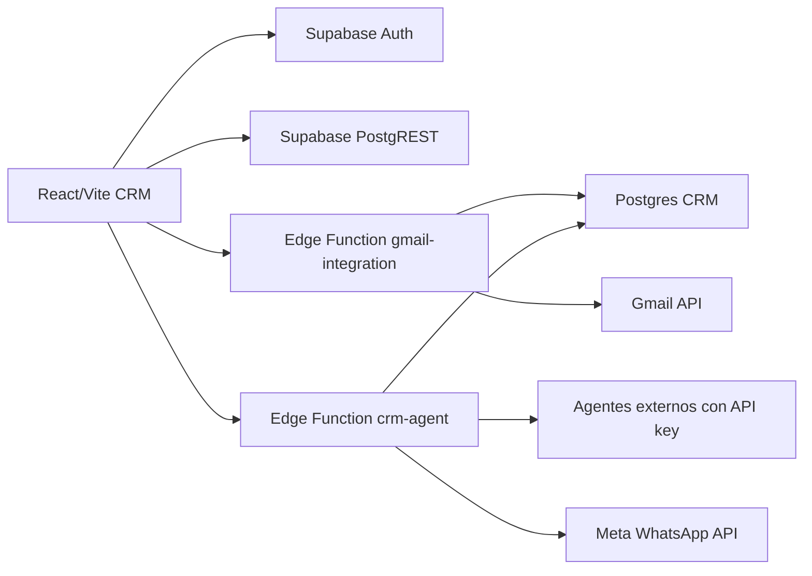

# Descubrimiento de arquitectura del copiloto

## Confirmacion del repositorio

Este repositorio corresponde al CRM Clima Activa/LatinChile real que se esta desplegando en Dokploy. La evidencia principal esta en:

- `src/App.tsx`: rutas protegidas del CRM.
- `src/modules/*`: modulos funcionales de dashboard, empresas, campanas, plantillas, prospeccion y administracion.
- `supabase/schema.sql`: esquema base de CRM.
- `supabase/functions/*`: Edge Functions existentes para agentes, Gmail y Meta/WhatsApp.
- `Dockerfile` y `nginx.conf`: empaquetado de la app web para produccion.

No existe un `AGENTS.md` propio del proyecto. Solo hay archivos `AGENTS.md` dentro de `node_modules`, por lo que no aplican como instrucciones del repositorio.

## Tecnologias encontradas

- Frontend: React 18, TypeScript, Vite, React Router y CSS global en `src/styles.css`.
- Iconos: `lucide-react`.
- Backend serverless: Supabase Edge Functions en Deno.
- Base de datos: Supabase Postgres con SQL en `supabase/*.sql`.
- Autenticacion: Supabase Auth desde `src/modules/auth/AuthContext.tsx`.
- Despliegue web: build estatico servido por Nginx en Docker/Dokploy.
- Integraciones existentes: Gmail OAuth, Meta WhatsApp, prospeccion y agente externo con API key propia.

## Autenticacion, roles y permisos

El frontend obtiene la sesion Supabase y luego lee `profiles.full_name` y `profiles.role`. Los roles actuales son:

- `administrador`
- `vendedor`
- `visualizador`

El esquema base no tiene tabla de tenants ni `tenant_id` en las entidades principales. El aislamiento multi-tenant solicitado aun no existe como modelo de datos. Por eso el copiloto inicial debe operar como monotenancy controlado por sesion y debe documentar este riesgo antes de ampliar capacidades.

## Entidades existentes

Entidades base en `supabase/schema.sql`:

- `profiles`
- `companies`
- `contacts`
- `interactions`
- `campaigns`
- `campaign_recipients`
- `message_templates`
- `tags`
- `company_tags`
- `tasks`
- `activity_logs`

Entidades adicionales para integraciones/prospeccion estan en archivos SQL separados dentro de `supabase/`.

## Rutas relevantes

- `/dashboard`
- `/empresas`
- `/empresas/:companyId`
- `/campanas`
- `/prospeccion`
- `/plantillas`
- `/administracion`

El copiloto se integra como nueva ruta protegida `/copiloto`, manteniendo el layout existente.

## Diagrama logico actual

## Puntos de integracion para el copiloto

- UI: nueva pagina React y item de navegacion.
- Backend: nueva Edge Function `crm-copilot`.
- Datos: migracion `supabase/openai_copilot.sql`.
- Seguridad: autenticacion por Bearer token de Supabase en la Edge Function, perfil/rol desde `profiles`.
- Auditoria: tablas dedicadas del copiloto y espejo resumido en `activity_logs` cuando corresponda.
- OpenAI: llamada server-side con `OPENAI_API_KEY`; el frontend nunca recibe secretos.

## Riesgos y vacios

- No existe `tenant_id`; no se puede probar aislamiento real entre tenants hasta agregar modelo de organizacion.
- RLS de lectura actual permite leer CRM a cualquier usuario autenticado.
- No hay capa de servicios compartida entre frontend y Edge Functions; la primera fase replica consultas de solo lectura en backend con validacion estricta.
- No hay framework de tests unitarios general. Existe una prueba contractual de prospeccion.
- No hay colas/jobs generales para campanas programadas desde copiloto.
- Las funciones self-hosted deben evitar imports remotos si el contenedor no resuelve DNS externo.

## Decisiones propuestas

- MVP de Fase 1 en modo solo lectura, sin herramientas de escritura.
- Edge Function sin imports externos remotos para evitar fallas de resolucion de nombres.
- OpenAI encapsulado en `crm-copilot`; frontend solo envia mensajes y conversationId.
- Herramientas iniciales acotadas:
  - `search_crm_entities`
  - `get_crm_entity`
  - `get_available_metrics`
  - `run_analytics_query`
  - `preview_customer_segment`
- Registrar mensajes, tool runs y auditoria sin guardar secretos ni razonamiento interno.
- Marcar acciones de campanas/tareas/dashboard como pendientes de fases futuras con confirmacion verificable.
